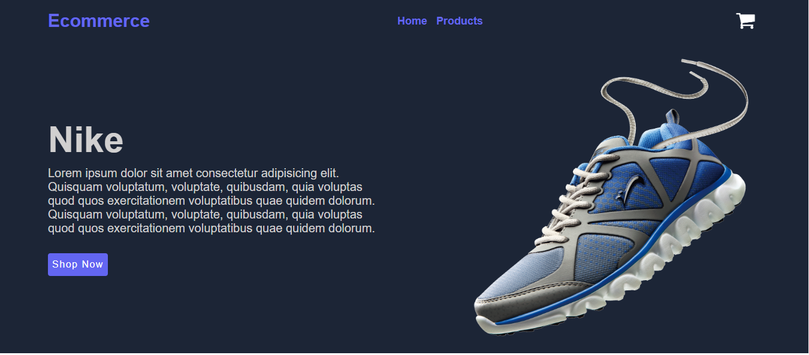
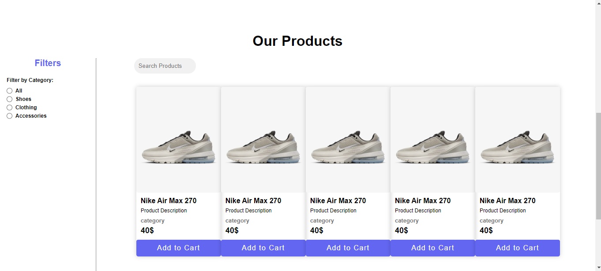
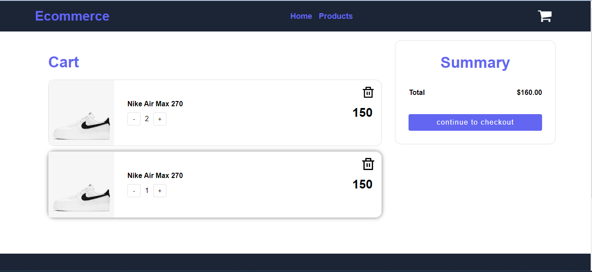

# ecommerce-team5

Our E-commerce specializes in selling clothes, shoes, and everything needed for fashion and elegance

 

 

## Features and Functionalities 😃

**User features**

- Full featured shopping cart
- Filtering (short by, category, & price range)
- Token based authentication
- Product search feature
- Save Cart
- Delete Cart
- Choose quantity (No of items to be order)

## Tech Stack 💻

- [React.js](https://reactjs.org/)
- [Node.js](https://nodejs.org/en/)
- [Express.js](https://expressjs.com/)
- [PostgreSQL](https://www.postgresql.org/)

---
